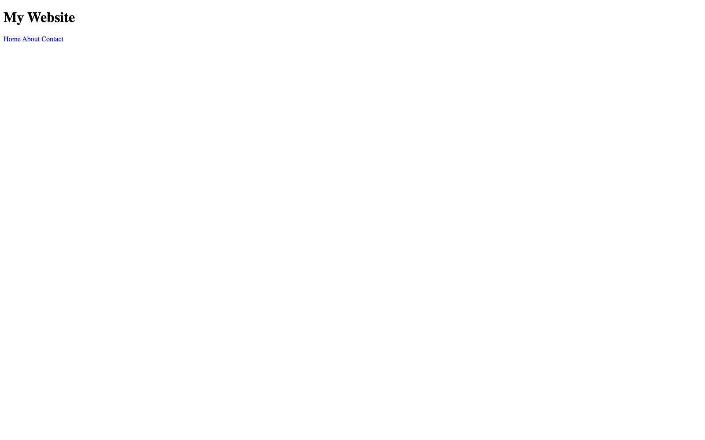
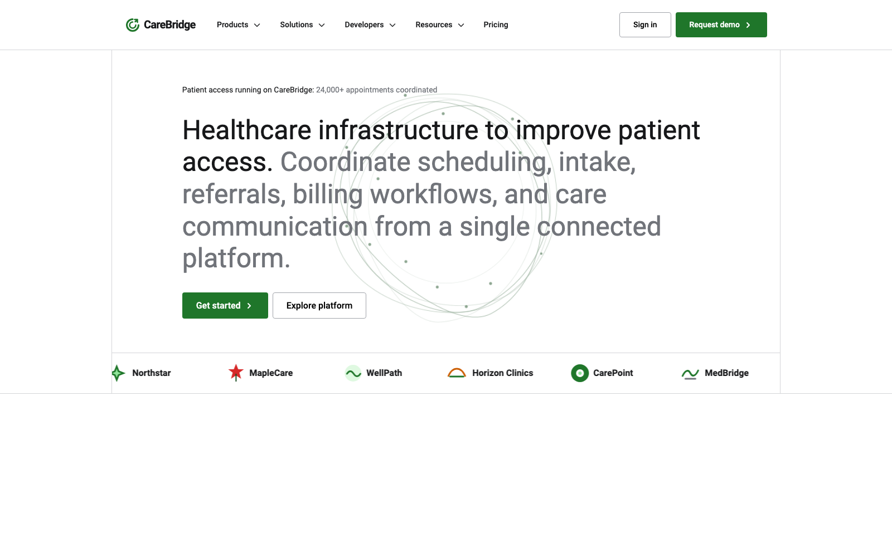

# Exercise 29 — CareBridge Navigation (Stripe system recreation)

[Live demo](https://vigneshsrinivasan-sys.github.io/exercise-29-carebridge-stripe-navigation/) · [Improved HTML source](index.html) · [Improved CSS source](styles.css) · [Original HTML](original/index.html) · [Original CSS](original/styles.css)

## Before and after

### Before — Colt Steele’s course version

### After — My version extends the course exercise with an expanded HTML/CSS interface.

## Why this exercise exists

This is an independent practice project completed while working through Colt Steele’s *The HTML & CSS Bootcamp*. The course provides the ordered learning content; I use each exercise to reinforce the concept until it is understood, then apply it in a concrete interface and push beyond the minimum lesson where appropriate. Together, these projects document a deliberate progression toward stronger design-to-code fluency as a Product Designer.

This build starts with Colt’s short responsive-navbar exercise and expands it into an independent educational recreation of Stripe’s navigation interaction and layout system. The branding, content, and implementation are CareBridge-specific; this is not an official Stripe clone or affiliated project.

## Focus

**Primary practice:** translating a small responsive-navigation lesson into a scalable, system-oriented product-navigation prototype with HTML and CSS only

- Four distinct mega menus: Products, Solutions, Developers, and Resources
- Desktop hover/focus coordination using relational selectors such as `:has()`
- Responsive structural changes at approximately 1263px, 1047px, and 639px
- Mobile hamburger/drill-down presentation, contextual Back state, independently scrollable menus, and reserved CTA-footer space
- Products menu rail, supporting links, and healthcare report card
- 12-column hero grid, selective `clamp()` typography, CSS logo marquee, and local Lottie background animation
- Reusable `ds-` design-system roles/tokens, `u-` utilities, `c-` components, and semantic component classes

## What I built

The improved version recreates the navigation architecture, spacing, surfaces, typography, dividers, menu rails, link treatments, animation language, and responsive layout transformations of Stripe’s live navigation as closely as possible within an HTML/CSS-only constraint. CareBridge provides independent healthcare-SaaS branding and content while preserving the interaction and layout study as the project’s core.

## Implementation notes

- The live demo and root source files are my completed CareBridge version. Colt’s original source is retained under [`original/`](original/) for direct comparison.
- The navigation is deliberately CSS-only. Hover/focus state can demonstrate the visual system, but CSS cannot provide robust persistent click/tap state management.
- Production limitations remain: click/tap persistence, true Back navigation, Escape and outside-click dismissal, synchronized `aria-expanded`, robust focus management, and dependable touch behavior would require JavaScript.
- The current ARIA structure is included where practical, but static attributes such as `aria-expanded="false"` cannot be synchronized by CSS alone.
- The local Lottie animation, healthcare report image, and supporting reference captures are kept in [`assets/`](assets/) and [`reference-images/`](reference-images/). Font Awesome and the LottieFiles web component remain external dependencies already used by the source.
- For local development, serve the project through VS Code Live Server or another local HTTP server so the Lottie asset loads reliably; opening the file directly with `file://` is not the intended local setup. GitHub Pages provides the public live demo over HTTP.
- The implementation source is preserved as completed; this repository adds packaging documentation and normalized relative paths only.

## Sequence

**Exercise 29** · Course-improved project · HTML & CSS Bootcamp Section 23
